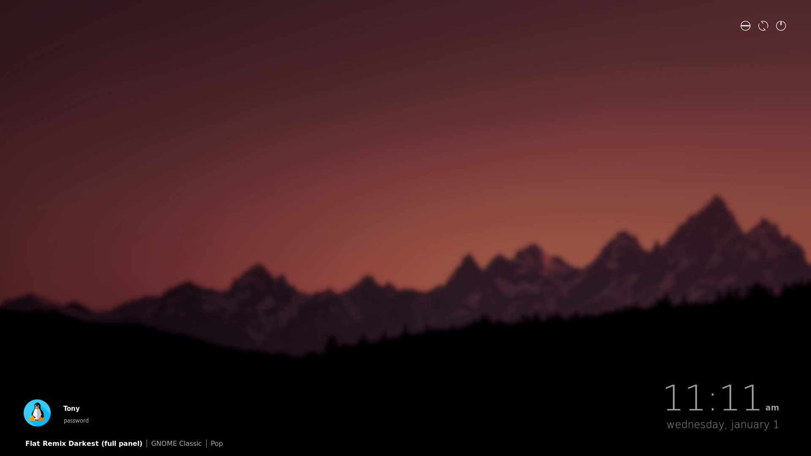

# visceral for lightdm-webkit2-greeter

## Installation

With administrator privileges (`sudo`):
1. Install the packages `lightdm` and `lightdm-webkit2-greeter`.
2. Clone this repository into a folder named `visceral` in `/usr/share/lightdm-webkit/themes/`.
3. Change the `greeter-session` key to `lightdm-webkit-greeter` in `/etc/lightdm/lightdm.conf`.

        [SeatDefaults]
        greeter-session = lightdm-webkit2-greeter

4. Change the `webkit_theme` key to `visceral` in `/etc/lightdm/lightdm-webkit2-greeter.conf`.

        [greeter]
        webkit_theme = visceral

5. Restart the LightDM service. (`systemctl restart lightdm.service`)

## Customization

### Background

The background images are located in the `/assets` folder, named `bg.jpg` and `bg-blurred.jpg`.

It is possible to change these images, either by replacing the images currently located in the `/assets` folder (and ensuring that they have the same filename and extension),
or by defining a custom path in the configuration file (explained in detail below). If you define a custom path, and the path is outside of the root folder of this theme, you *must* define an absolute path.

The images must have the correct file permissions (`chmod 644`) in order to display.

The included blurred background image uses 20% gaussian blur; I used [GIMP](https://www.gimp.org/) to edit it.

### Avatar

Your user avatar must be named `.face` in your `/home/` directory, and should be at least 64x64.

### Configuration File

This theme contains a few options you can configure within [cfg.js](../cfg.js):

* **`cfg_12h`**: Toggles whether 12-hour or 24-hour time is enabled.
    - Accepted Values: `true` or `false`
* **`cfg_placeholder`**: A string containing the placeholder for the password.
* **`cfg_bg_path`**: A string containing the path to the background image.
* **`cfg_bg_blurred_path`**: A string containing the path to the blurred background image.
* **`cfg_font-family`**: A string containing the font family name and the generic family name, respectively.
    - Example: `"Helvetica, sans-serif"`

## Credits
* [@ffwff](https://github.com/ffwff/) for creating his ['modern' theme](https://github.com/ffwff/modern) that I based this off of.
* [InterfaceLift](https://interfacelift.com/wallpaper/details/4180/grand_teton_sunset.html) for the background.